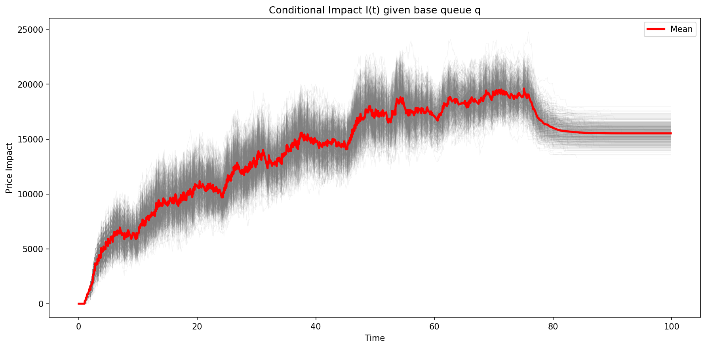
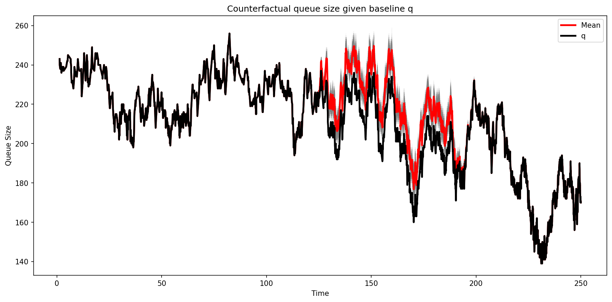
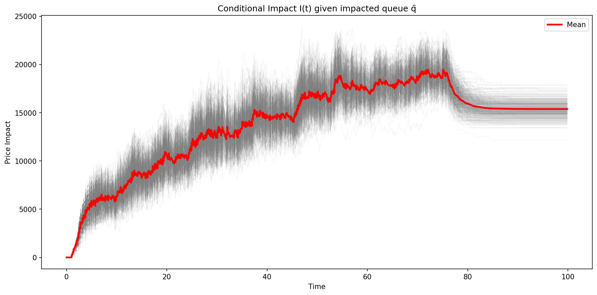
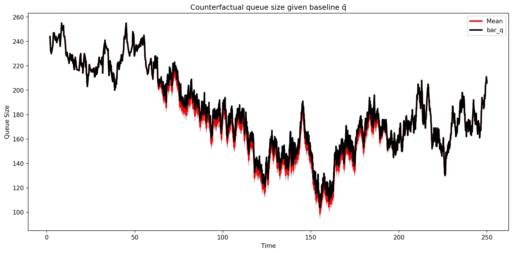

# Passive Impact Simulation

Rust library for passive market impact analysis using Markovian limit order book dynamics and Hawkes processes.

## Output

<p align="center">
  
  
</p>
<p align="center">
  
  
</p>

*Conditional simulation of 500 counterfactual paths (gray) with mean (red) and baseline (black).*

## Overview

Framework for conditional simulation of point processes with Markovian intensity:

- **Queue dynamics**: Inhomogeneous Poisson with state-dependent intensities
- **Market orders**: Hawkes process with multi-exponential kernel
- **Conditional impact**: Closed-form computation relying on propagator operator.

## Quick Start

### Hawkes Process

```rust
use simulation_project::models::MultiExponentialHawkes;
use simulation_project::simulation::simulate;

let mu = 1.0;
let alpha = vec![0.065, 0.2, 0.325, 0.65];
let beta = vec![0.15, 0.60, 2.5, 10.0];

let hawkes = MultiExponentialHawkes::new(mu, alpha, beta);
let result = simulate(&hawkes, 100.0, Some(42));
```

### Affine Queue

```rust
use simulation_project::models::AffineQueueProcess;
use simulation_project::simulation::simulate;

// λ^L(q) = a_l + b_l·q,  λ^C(q) = a_c + b_c·q
let process = AffineQueueProcess::new(
    200.0,  // initial queue
    100.0, -0.275,  // a_l, b_l
    2.0, 0.125,     // a_c, b_c
    mu, alpha, beta,
);

let result = simulate(&process, 100.0, None);
let queue_path = AffineQueueProcess::result_to_queue_path(&result, 200);
```

### Conditional Impact

```rust
use simulation_project::conditional_impact::{TailImpact, ImpactPath};

let tail_impact = TailImpact::from_affine_queue(
    mu, alpha, beta, b_l, b_c, market_order_times
);
let impact = ImpactPath::new(&q_path, &bar_q_path, &tail_impact);
```

## Mathematical Background

### Hawkes Process

Conditional intensity with multi-exponential kernel:

$$\lambda_t = \mu + \sum_{i=1}^{k} R^i_t, \quad \varphi(s) = \sum_{i=1}^{k} \alpha_i e^{-\beta_i s}$$

Markovian state $R^i_t$ enables O(1) intensity updates.

### Queue Dynamics

- **Limits**: $\lambda^L(q) = a_l + b_l \cdot q$
- **Cancels**: $\lambda^C(q) = a_c + b_c \cdot q$
- **Markets**: Hawkes process

### Conditional Impact

$$I(t) = c_\kappa \int_0^t (\bar{q}_s - q_s) \, dN_s + c_\kappa (\bar{q}_t - q_t) \cdot \mathcal{I}_t$$

where the following term admits a closed form relying on the propagator operator:
$$\mathcal{I}_t = \int_t^\infty e^{-c_\lambda(s-t)} \mathbb{E}_t[\lambda_s] ds.$$

## Modules

| Module | Description |
|--------|-------------|
| [`models`](src/models/) | Hawkes, queues, Markovian abstractions |
| [`simulation`](src/simulation/) | Thinning algorithm, conditional simulation |
| [`conditional_impact`](src/conditional_impact/) | Propagator computation, impact analysis |
| [`utils`](src/utils/) | IVT root-finding, finite differences |

## Running

```bash
cargo run --release --bin paths_with_us
cargo run --release --bin paths_without_us

cd python && python plot_utils.py
```

Outputs: `impact_paths.npy`, `queue_paths.npy`, `times.npy` (and `*_without.npy` variants).
