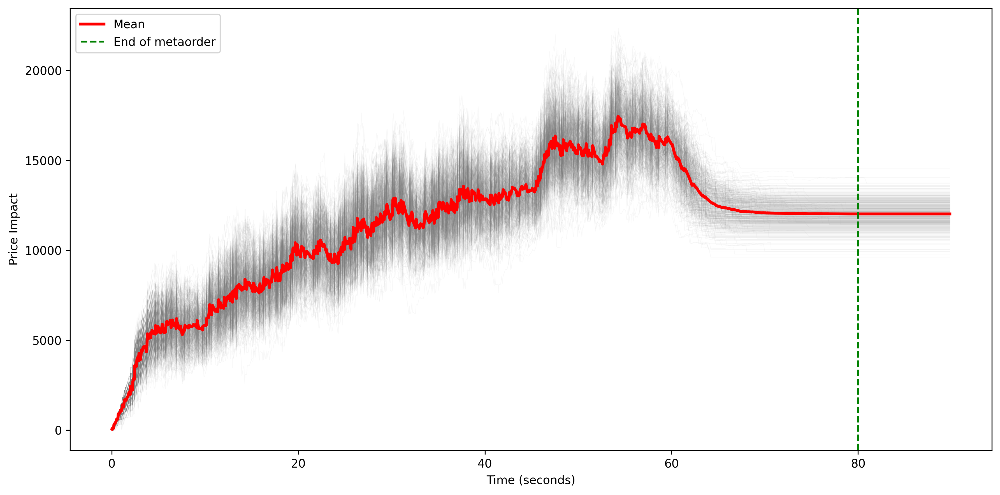
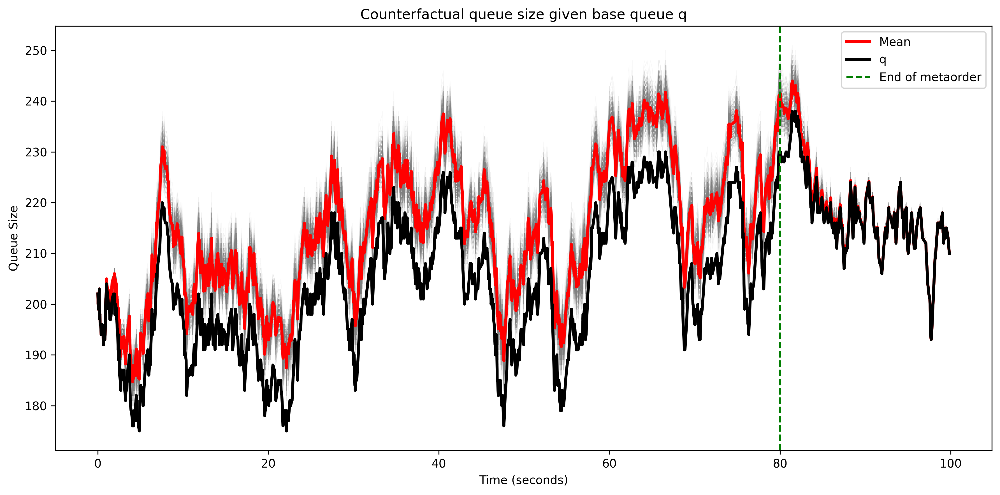
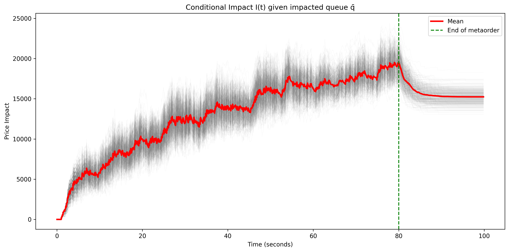
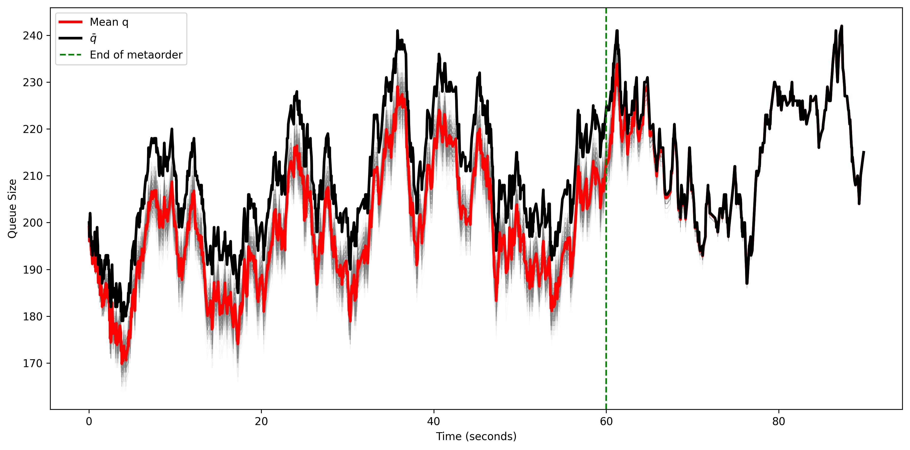

# Passive Market Impact Simulation

A high-performance Rust library for simulating and analyzing market impact using point processes. Combines Hawkes processes (for market orders) with queue-reactive Markovian dynamics (for limit orders and cancellations) to compute the price effect of trading strategies through conditional path simulation. The library accompanies the work on conditional simulation of Poisson measures and market impact.

## Visual Overview

<p align="center">
  
  
</p>
<p align="center">
  
  
</p>

*Conditional simulation of 500 counterfactual market paths (gray shading) with empirical mean (red) and observed baseline (black). Each panel shows a different initial queue state.*

## What This Library Provides

- **Exact conditional simulation of Poisson processes** given an observed trajectory, by adding or removing jump times consistently with the conditioning.
- **Counterfactual queue simulation** from an observed queue trajectory:
  - *Removing a metaorder*: start from a trajectory that contains a metaorder and simulate the queue that would have been observed if the metaorder had not been sent.
  - *Adding a metaorder*: start from a baseline trajectory and inject a hypothetical buy/sell metaorder executed through limit or market orders.
- **Conditional market impact** from observed and counterfactual queues, covering passive limit-order and aggressive market-order strategies on the same realised trajectory.
- **Ex-post and alternative-strategy analysis**: recover the conditional distribution of impact for an executed strategy, or compare hypothetical strategies against the same observed market path.
- **Closed-form market impact computation** under Hawkes market-order flow with sum-of-exponentials kernels, using resolvent methods to avoid nested Monte Carlo.
- **Anchored impact-cost experiments** that replay empirical queue snapshots and sample execution-time cost jumps for passive lifecycle strategies.
- **Flexible architecture** supporting both single-queue and bid-ask queue-pair scenarios, with optimized ("efficient") and general simulation variants.

## Setup

Fresh-clone workflow using [`uv`](https://docs.astral.sh/uv/) (recommended):

```bash
git clone https://github.com/tosmeow/passive-impact.git
cd passive-impact

uv venv
source .venv/bin/activate
unset CONDA_PREFIX
uv pip install -e ".[dev]"
maturin develop --release --manifest-path code/python/Cargo.toml
```

Notes on the steps:
- `unset CONDA_PREFIX` is needed only if your shell auto-activates a conda env (you'll see `(base)` in your prompt). Maturin refuses to build when both `VIRTUAL_ENV` and `CONDA_PREFIX` are set.
- `uv pip install -e ".[dev]"` installs the dev tooling (maturin, pytest, jupyter, ipykernel, nbconvert).
- On Python ≥3.13, prefix the `maturin develop` command with `PYO3_USE_ABI3_FORWARD_COMPATIBILITY=1`.

Verify the install (the full Python suite should pass, then prints `0.1.0`):

```bash
pytest code/python/tests/
python -c "import simproj; print(simproj.__version__)"
```

> **Note:** `cargo build` from the repo root will also try to build the bindings crate. On Python ≥3.13, set `PYO3_USE_ABI3_FORWARD_COMPATIBILITY=1` for that path too, or build the lib in isolation with `cargo build -p simulation_project`.

## Quick Start (Python)

After [Setup](#setup), run any of the three simulation demo categories from Python — each ships a `custom_experiment/main.py` whose top section is a config dataclass. Edit the config, run the file, and `.npy` outputs land in `output/`.

```python
# experiments/passive_impact/custom_experiment/main.py
from simproj import passive_impact as pi

config = pi.PassiveImpactConfig(
    time_horizon=100.0,
    n_simulations=500,
    initial_queue_size=200,
    mode="single",                 # "single" | "double"
    side="both",                   # "with" | "without" | "both"
    mu=1.0,
    alpha=[0.065, 0.2, 0.325, 0.65],
    beta=[0.15, 0.60, 2.5, 10.0],
    a_l=100.0, b_l=-0.275, a_c=2.0, b_c=0.125,
    # Metaorder accepts: int N (evenly spaced inside metaorder_window)
    #                    list/ndarray (explicit arrival times — window ignored)
    metaorder=375,
    metaorder_window=(1.0, 80.0),
    seed=42,
)

result = pi.run(config)               # dict[str, np.ndarray]
pi.save(result, "experiments/passive_impact/custom_experiment/output/")
```

Run it:

```bash
python experiments/passive_impact/custom_experiment/main.py
```

The same shape applies to `agressive_impact` and `queue_simulation` — each has its own config dataclass (`AggressiveImpactConfig`, `QueueSimulationConfig`) and `main.py` template. The empirical passive execution-cost workflow lives under [`experiments/impact_cost/`](experiments/impact_cost/) and is driven by the canonical lifecycle config in `load_experiments/config.toml`.

## Mathematical Background

### Hawkes Process

A Hawkes process is a self-exciting Poisson process with intensity

$$\lambda_t = \mu + \int_0^{t-} \varphi(t-s)\,dN_s.$$

Here $\mu$ is the baseline exogenous intensity and $\varphi$ is the
self-exciting kernel. In this library we mostly use sum-of-exponentials
kernels:

$$
\lambda_t = \mu + \sum_{i=1}^{k} R^i_t,
\qquad
\varphi(s) = \sum_{i=1}^{k} \alpha_i e^{-\beta_i s}.
$$

The Markovian states
$R^i_t := \int_0^{t-} \alpha_i e^{-\beta_i(t-s)} dN_s$
enable constant-time intensity updates. Power-law kernels can also be
approximated by sums of exponentials, so this representation remains flexible.

### Aggregate Queue Dynamics

The aggregate ask and bid queues are modeled as

$$
q^a = L^a - C^a - N^a,
\qquad
q^b = L^b - C^b - N^b.
$$

For $x \in \{a,b\}$, the processes $L^x$ and $C^x$ represent limit orders and
cancellations with queue-reactive affine intensities:

$$
\lambda^{L,x}(q) = a_l + b_l q,
\qquad
\lambda^{C,x}(q) = a_c + b_c q,
$$

with $b_l < 0$ and $b_c > 0$. Market-order flows $N^a$ and $N^b$ are modeled
with Hawkes processes.

### Price Process

The price is the anticipation of future order flow, allowing each market
order's contribution to depend on available liquidity:

$$
P_t =
P_0 + \lim_{T\to\infty}
\mathbb{E}\left[
\int_0^T \kappa(q^a_s)\,dN^a_s
- \int_0^T \kappa(q^b_s)\,dN^b_s
\middle| \mathcal{F}_t
\right].
$$

Here $\kappa$ is the liquidity-dependent impact function.

### Conditional Impact

For a metaorder $X^o$ executed on the ask side, the observed ask queue and
price can be written as

$$
\bar{q}^{a,t}_s
= q^a_0 + \bar{L}^{a,t}_s - \bar{C}^{a,t}_s - N^a_s + X^{o,t}_s,
\qquad s \ge 0,
$$

with $X^{o,t}_s := X^o_{s \wedge t}$. This covers passive metaorders
($X^o=L^o$) and aggressive metaorders ($X^o=-N^o$). The market impact is

$$
MI(t) = \bar{P}_t - P_t.
$$

Conditional simulation gives a distribution of $MI(t)$ by comparing the
observed and counterfactual queue paths under the same market history.

### Passive Market Impact

For a passive metaorder executed through limit orders, affine queue
intensities, affine impact $\kappa(q)=c_\kappa q + d_\kappa$, and a
sum-of-exponentials Hawkes kernel, the passive impact admits a closed form
based on the resolvent operator $(\delta_0-\varphi)^{-1}$.

In the single-queue notation used by the implementation, with
$c_\lambda := b_c - b_l$, the impact has the form

$$
I(t)
= c_\kappa \int_0^t (\bar{q}_s - q_s)\,dN_s
+ c_\kappa(\bar{q}_t - q_t)\mathcal{I}_t,
$$

where

$$
\mathcal{I}_t =
\int_t^\infty e^{-c_\lambda(s-t)}\mathbb{E}_t[\lambda_s]\,ds.
$$

For fitted tail-propagator experiments, the calibrated input is a price
propagator rather than a Hawkes kernel:

$$
G(u)=\kappa_s+\sum_{i=1}^m w_i e^{-\beta_i u}
=\kappa_s\,\xi(u),
\qquad
\xi(u)=1+\sum_{i=1}^m a_i e^{-\beta_i u}.
$$

The propagator-implied response kernel gives the passive continuation kernel

$$
K_C(a)=\int_0^\infty e^{-C_\lambda u}r(a+u)\,du
=\sum_{i=1}^m \eta_i e^{-\beta_i a},
\qquad
\eta_i=\frac{\beta_i w_i}{\kappa_s(\beta_i+C_\lambda)}.
$$

With signed queue displacement $U_t=s(\bar q_t-q_t)$ and fitted queue slope
$\kappa_1$, the evaluated impact is written in the same realized-plus-tail
form:

$$
MI(t)
=\kappa_1\int_0^t U_s\,dN_s
+\kappa_1 U_t
\left(
\zeta+\int_0^t K_C(t-s)\,dN_s
\right).
$$

The config-level mapping is documented in
[`experiments/impact_cost/load_experiments/FORMULAS.md`](experiments/impact_cost/load_experiments/FORMULAS.md).

### Aggressive Market Impact

For aggressive metaorders, the strategy consumes liquidity directly through
market orders. The propagator and hybrid models in `conditional_impact`
compare the impacted queue path against the no-metaorder counterfactual and
propagate the resulting order-flow shock through the price kernel.

## Modules

| Module | Description |
|--------|-------------|
| [`models`](code/src/models/) | Hawkes, queues, Markovian abstractions |
| [`simulation`](code/src/simulation/) | Thinning algorithm, conditional simulation |
| [`simulation_helpers`](code/src/simulation_helpers/) | Parallel batch simulation, event utilities |
| [`conditional_impact`](code/src/conditional_impact/) | Resolvent and propagator impact models |
| [`experiments::impact_cost`](code/src/experiments/impact_cost/) | Experiment-scoped native helpers for anchored empirical queues and passive execution fills |
| [`utils`](code/src/utils/) | IVT root-finding, finite differences |

## Experiments

Four top-level experiment categories live under `experiments/`:

| Category | What it shows | Entry points |
|---|---|---|
| **Passive Impact** | Conditional impact from limit-order metaorders (single + double queue) | [`load_experiments/analysis.ipynb`](experiments/passive_impact/load_experiments/analysis.ipynb), [`custom_experiment/main.py`](experiments/passive_impact/custom_experiment/main.py) |
| **Aggressive Impact** | Market-order impact under propagator and hybrid models | [`load_experiments/analysis.ipynb`](experiments/agressive_impact/load_experiments/analysis.ipynb), [`custom_experiment/main.py`](experiments/agressive_impact/custom_experiment/main.py) |
| **Queue Simulation** | Counterfactual queue paths under a metaorder (no impact curve) | [`load_experiments/analysis.ipynb`](experiments/queue_simulation/load_experiments/analysis.ipynb), [`custom_experiment/main.py`](experiments/queue_simulation/custom_experiment/main.py) |
| **Impact Cost** | Empirical passive lifecycle execution-cost workflow using aggregate queue snapshots and tail-propagator price impact | [`README.md`](experiments/impact_cost/README.md), [`COMPONENTS.md`](experiments/impact_cost/COMPONENTS.md), [`load_experiments/`](experiments/impact_cost/load_experiments/) |

For the older simulation experiments, each `load_experiments/` folder contains
the notebook, plot utilities, and a `data/` subtree where the Rust binaries
write `.npy` files. The impact-cost `load_experiments/` folder instead uses a
single `config.toml`, CSV outputs, and figure utilities. Generated data is
gitignored unless explicitly promoted. Each `custom_experiment/` folder
contains a single `main.py` whose top section is a config dataclass; edit and
run.

### Run a custom experiment (Python — primary user path)

Edit the config block at the top of the relevant `main.py`, then run it:

```bash
python experiments/passive_impact/custom_experiment/main.py
python experiments/agressive_impact/custom_experiment/main.py
python experiments/queue_simulation/custom_experiment/main.py
```

Outputs (`.npy` arrays) land in each folder's `output/` (gitignored). The Python facades produce the same shapes as the Rust binaries — see each `<Category>Config` dataclass in [`code/python/simproj/`](code/python/simproj/) for the full set of knobs (Hawkes parameters, queue parameters, metaorder shape, propagator vs. hybrid model, etc.).

### Run the impact-cost workflow

The canonical impact-cost experiment now lives under
`experiments/impact_cost/load_experiments/`. Edit its `config.toml`, then run
the lifecycle workflow:

```bash
python -m experiments.impact_cost.load_experiments.lifecycle_passive_cost \
  --config experiments/impact_cost/load_experiments/config.toml
```

This lifecycle path is fixed to the tail-propagator impact model. CSV/JSON
outputs land under `load_experiments/data/`; PNG figures land under
`load_experiments/images/`. Older raw-fill inference and diagnostic scripts are
kept under `experiments/impact_cost/archive/diagnostics/`.

Start with [`experiments/impact_cost/README.md`](experiments/impact_cost/README.md) for the queue/price-sign conventions and [`experiments/impact_cost/COMPONENTS.md`](experiments/impact_cost/COMPONENTS.md) for the component map.

### Inspect pre-saved baselines (notebooks)

Each category's `load_experiments/analysis.ipynb` loads `.npy` data from its sibling `data/` directory and renders the standard plots. The `.npy` files are gitignored — regenerate them via the Rust binaries below before opening the notebook on a fresh checkout.

### Regenerate baselines (Rust binaries)

The original Rust binaries still exist for fast batch baseline generation:

    cargo run --release --bin single_queue_efficient_with_us
    cargo run --release --bin single_queue_efficient_without_us
    cargo run --release --bin double_queue_efficient_with_us
    cargo run --release --bin double_queue_efficient_without_us
    cargo run --release --bin agressive_impact
    cargo run --release --bin agressive_impact_hybrid
    cargo run --release --bin queue_simulation_efficient

(General variants are also kept for validation: `*_general_with_us`, `*_general_without_us`.)

---

## Dependencies

- `numpy`, `pandas`, `matplotlib`, `pyarrow`: Python facades, plotting, and parquet-backed experiment inputs
- `maturin`, `pyo3`: Rust-to-Python bindings (development only)
- `pytest`: Testing framework
