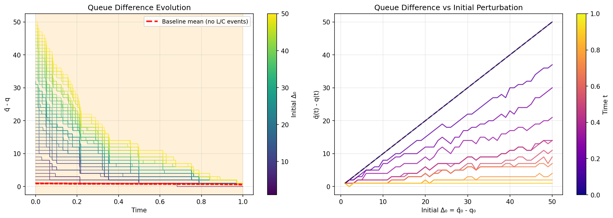
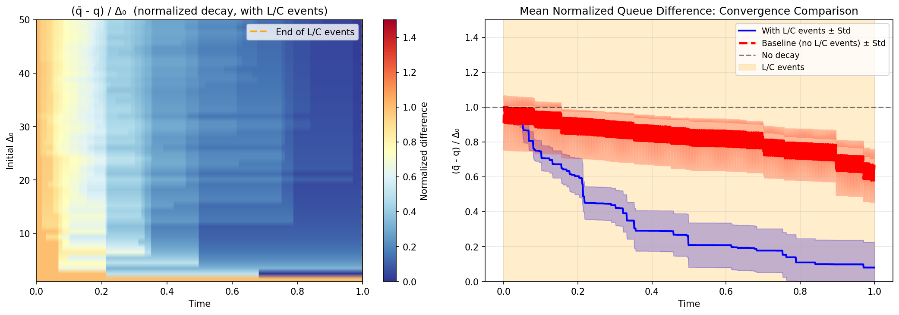
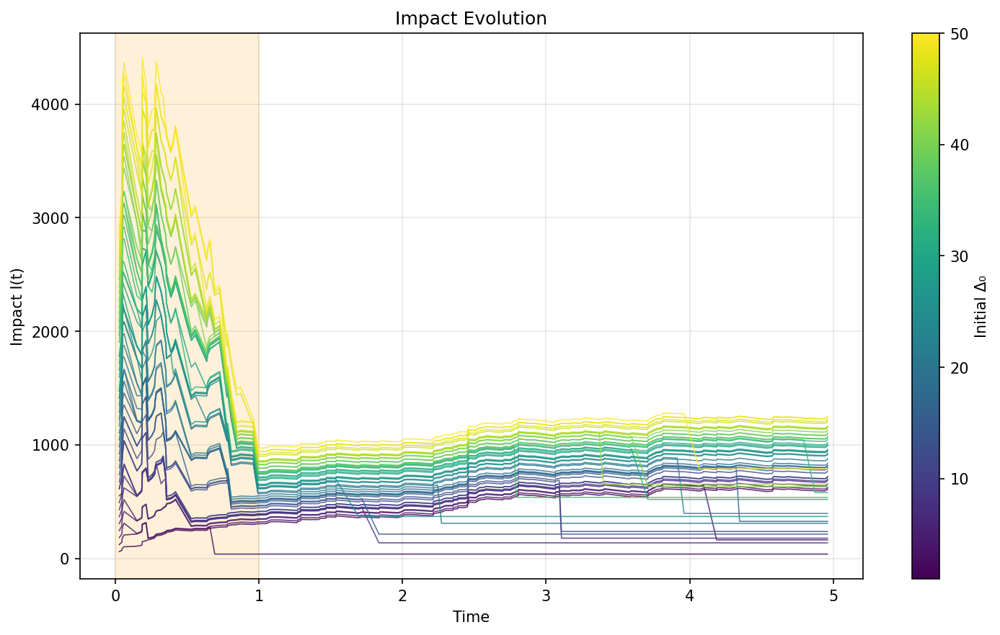
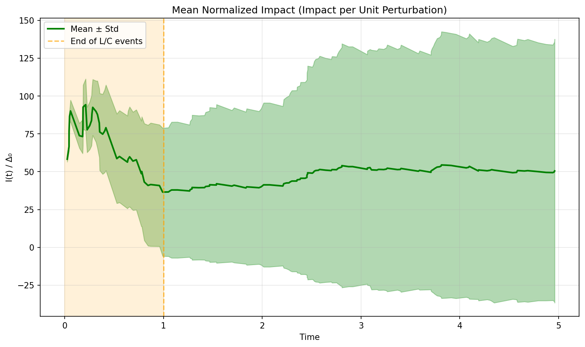

# Extreme Events

**Paper section**: Additional experiment — not in paper

## What This Shows

Investigates how market impact evolves during extreme order flow events — specifically, a cascade of alternating limit orders and cancellations that might occur during a mid-price move. The experiment measures how quickly queue differences decay and impact "goes stale" when such clustering events occur.

## Setup

We simulate a queue process over a time horizon T = 5, with:
- **Reference path** q: A queue starting at q₀ = 200, driven by Hawkes market orders
- **Counterfactual paths** q̄: Same Hawkes events, but with perturbed initial states q̄₀ = q₀ + Δ₀ for Δ₀ ∈ {1, 2, ..., 100}

### Extreme Event Injection

In the interval [0, 1], we inject **1000 alternating limit/cancel events** (L, C, L, C, ...) evenly spaced in time. These synthetic events:
- Have zero net effect on the queue level (equal L and C)
- Create high-frequency coupling opportunities between q and q̄
- Are treated as **conditioning events** — q̄ thins against these events with acceptance probability λ_q̄ / λ_q

### Modeling reason

When the mid-price moves, the intensity of cancelations and limit insertions clusters very heavily as people get out of current queue and replace their orders to the new appropriate best. 

We wanted to see experimentaly within the model if this does a reseting effect on our impact distribution for the next timestamps when such large clusters of events occur.

### Parameters

| Parameter | Value | Description |
|-----------|-------|-------------|
| a_L | 100 | Limit order baseline intensity |
| b_L | -0.275 | Limit order queue sensitivity (λ^L = a_L + b_L·q) |
| a_C | 2 | Cancel order baseline intensity |
| b_C | 0.125 | Cancel order queue sensitivity (λ^C = a_C + b_C·q) |
| μ | 1 | Hawkes baseline intensity |
| α | [0.065, 0.2, 0.325, 0.65] | Hawkes excitation coefficients |
| β | [0.15, 0.6, 2.5, 10.0] | Hawkes decay rates |

---

## Question 1: How does $\bar{q} - q$ decay during extreme events?

Since q̄₀ > q₀, the counterfactual queue starts higher. Due to the affine intensity structure:
- Higher queue → lower limit intensity (b_L < 0)
- Higher queue → higher cancel intensity (b_C > 0)

This creates a **mean-reverting coupling**: $\bar{q}$ is more likely to miss limit orders and accept cancel orders from $q$, causing $\bar{q} - q$ to decay toward zero.

### Result: Queue Difference Evolution



**Left panel**: Time evolution of $\bar{q}(t) - q(t)$ for all initial perturbations Δ₀. The colored lines (viridis) show the L/C-conditioned scenario with rapid decay during [0, 1]. The **red dashed line** shows the baseline scenario without L/C event injection, which decays much more slowly. This directly illustrates the acceleration effect of extreme events.

**Right panel**: Queue difference as a function of initial perturbation at different time snapshots. The relationship remains monotonic (larger Δ₀ → larger difference) but the slope decreases over time, indicating proportional decay.

### Normalized Decay Analysis



**Left panel**: Heatmap of ($\bar{q}-q$) / Δ₀ showing uniform decay across all initial perturbations in the L/C-conditioned scenario.

**Right panel**: **Convergence comparison** — shows both scenarios on the same axes:
- **Blue curve (with L/C events)**: Mean normalized difference drops from 1.0 to approximately 0.2-0.3 by t = 1, demonstrating that ~70-80% of the initial queue difference is eliminated during the extreme event window.
- **Red dashed curve (baseline, no L/C events)**: Mean normalized difference remains around 0.7-0.8 at t = 1, showing much slower decay when the extreme events are absent.

The vertical separation between the two curves quantifies the **impact of extreme event-driven convergence speed**.

---

## Question 2: How does impact stale during extreme events?

Impact measures the cumulative price effect of the queue difference. As $\bar{q}-q$ decays, we expect impact to:
1. Grow initially as differences accumulate price effects
2. Eventually stabilize or decay as the queue difference vanishes

### Result: Impact Evolution



Impact I(t) for all initial perturbations (colorbar shows Δ₀). Impact peaks early in the L/C window then decays sharply as the queue differences collapse. Higher initial perturbations produce higher peak impact but all paths converge toward similar values by t ≈ 2.

### Mean Normalized Impact



Mean I(t) / Δ₀ with ± std band. The mean peaks around t ≈ 0.2-0.3 then decays during the L/C window, stabilizing around 50 after t = 1. The growing std after t = 1 reflects that small Δ₀ paths (which don't fully couple) behave differently from large Δ₀ paths.

---

## How to Run

```bash
# Generate data for all 100 initial perturbations
cargo run --release --bin extreme_events

# Analyze and visualize (plots are saved to images/ folder)
cd python/experiments/extreme_events
python plot_utils.py
```

---

## Key Findings

1. **Rapid coupling**: The alternating L/C events create strong coupling between $q$ and $\bar{q}$, eliminating sharply initial queue differences within the [0, 1] window.

2. **Monotonicity preserved**: Due to shared random numbers in the thinning algorithm, $\bar{q}_1 - q > \bar{q}_2 - q$ whenever Δ₀₁ > Δ₀₂ (no path crossings).

3. **Impact staleness**: Impact has two components: a cumulative term (sum of past queue differences at market orders) that grows, and a tail term `(q̄ - q) × tail_factor` representing future impact potential. During extreme events, the tail term shrinks faster than cumulative grows — because both the queue difference decays rapidly and less future time remains — causing total impact to peak then decline.
