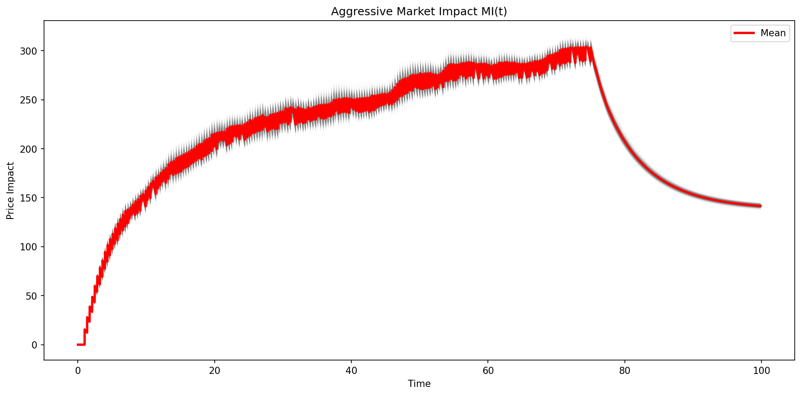
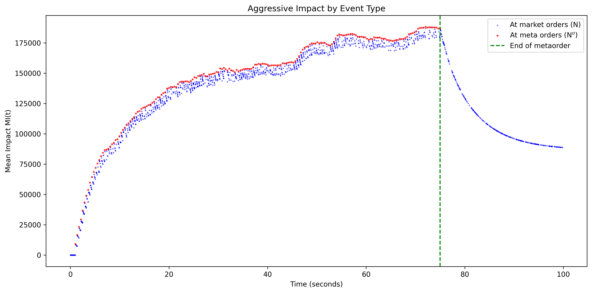
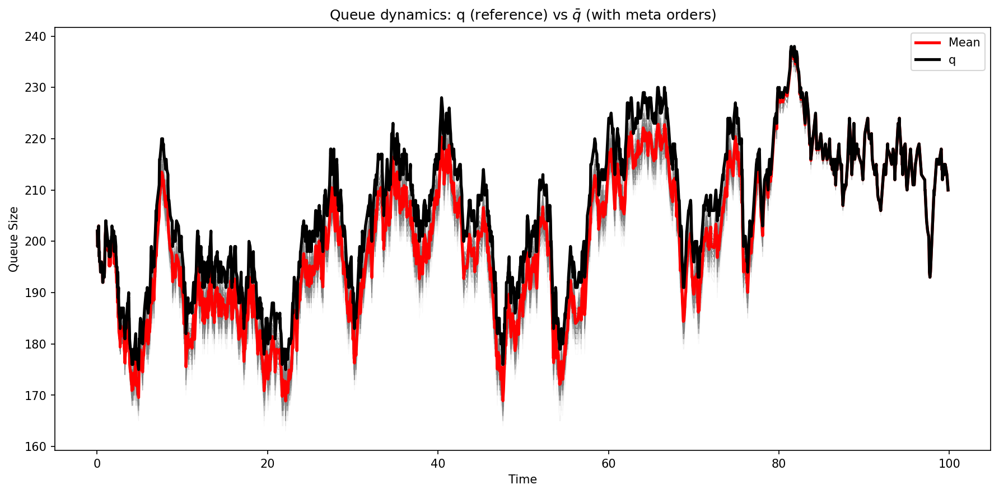
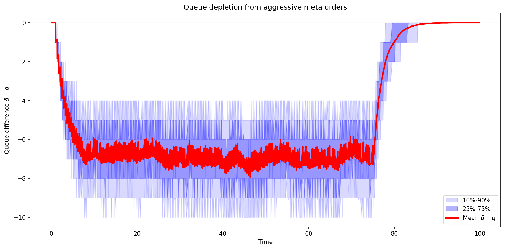

# Aggressive Impact

Market-order impact under the propagator price model. A buy-side metaorder consumes ask liquidity; the price responds through the propagator kernel $G(t) = 1 + \sum_i \frac{\alpha_i/\beta_i}{1-\|\varphi\|_1} e^{-\beta_i t}$.

## Setup

- **Price model**: $P_t = \int_0^t \kappa(q^a_s) G(t-s) \, dN^a_s - \int_0^t \kappa(q^b_s) G(t-s) \, dN^b_s$
- **Impact function**: $\kappa(q) = -0.002q + 1$ (decreasing in queue depth)
- **Propagator**: $G(0) = 1/(1-\|\varphi\|_1) \approx 26$ (mean cluster size), $G(\infty) = 1$
- **Metaorder**: 200 market-order events
- **Paths**: 500 conditional simulations, horizon $T = 100$.

## Results

### Impact trajectory

<p align="center">
  
  
</p>

*Left*: Distribution of aggressive impact $MI(t)$ across 500 counterfactual paths (gray), with mean in red. *Right*: Mean impact decomposed by event type — blue dots at market order times ($dN^a$), red dots at metaorder times ($dN^{o,a}$).

### Queue dynamics

<p align="center">
  
  
</p>

*Left*: Counterfactual queue $\bar{q}$ (with metaorder, gray paths) versus baseline $q$ (black). *Right*: Queue depletion $\bar{q} - q$ with quantile bands — the metaorder progressively reduces the queue, which amplifies impact through $\kappa$.

## How to Run

```bash
cargo run --release --bin agressive_impact
python plot_utils.py
```
