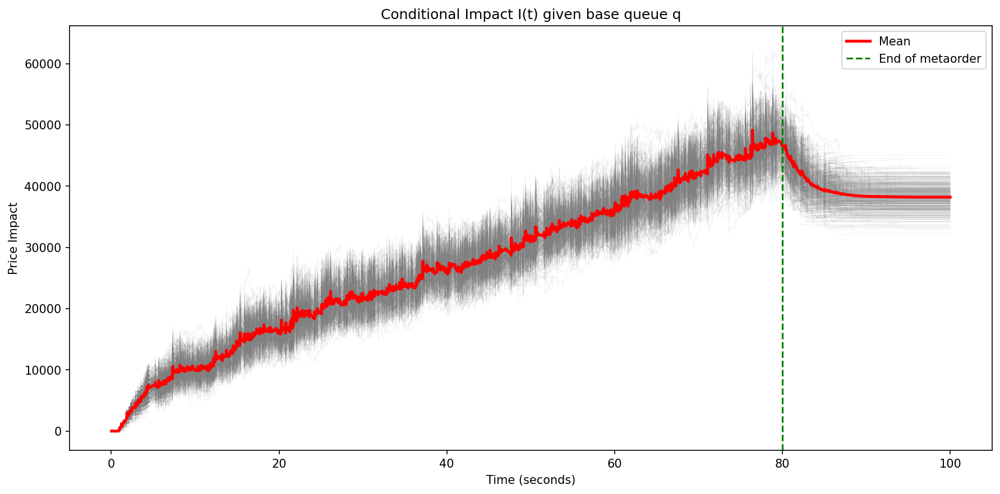
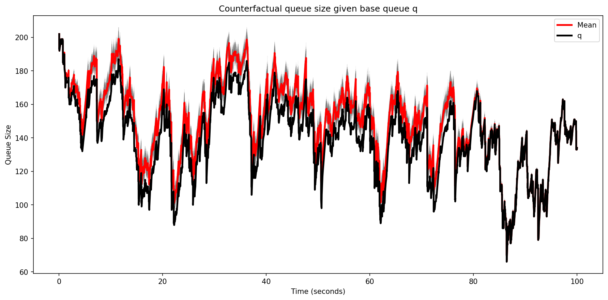
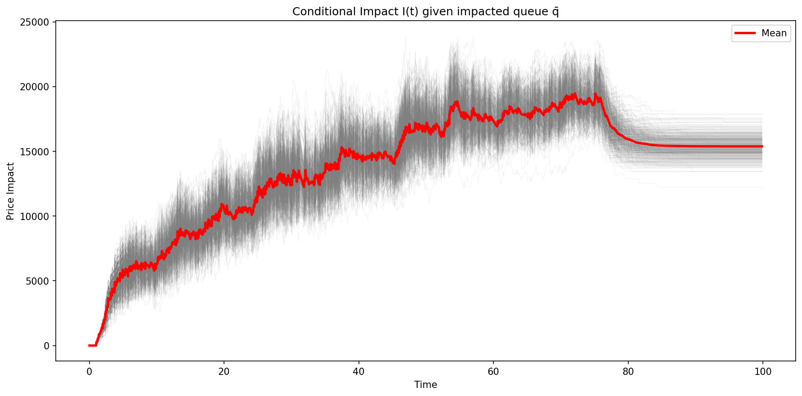
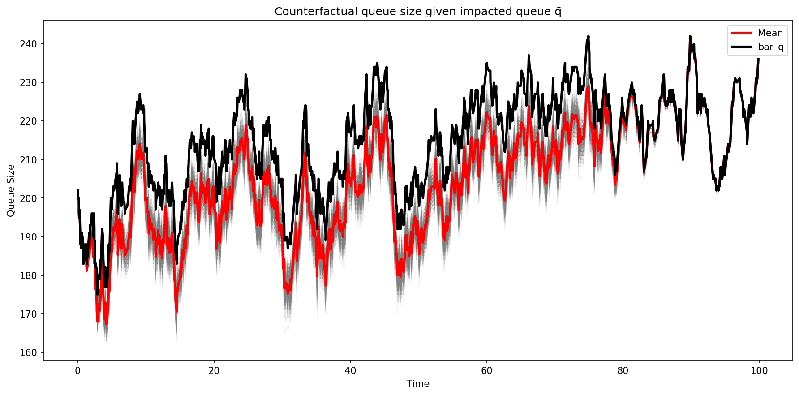

# Single Queue Impact

Passive market impact from a limit-order metaorder in a single-sided queue. We compare 500 counterfactual paths (gray) against the observed baseline (black), with the empirical mean in red.

## Setup

- **Queue**: $\lambda^L(q) = 100 - 0.275q$, $\lambda^C(q) = 2 + 0.125q$
- **Market orders**: Hawkes with $\alpha = [0.065, 0.2, 0.325, 0.65]$, $\beta = [0.15, 0.60, 2.5, 10.0]$
- **Metaorder**: Deterministic limit orders at rate $\nu = 5$/s for 80s
- **Paths**: 500 conditional simulations, horizon $T = 100$s

## Results

### Conditioning on the baseline queue $q$

<p align="center">
  
  
</p>

*Left*: Distribution of passive impact $I(t)$ across counterfactual paths, given the observed queue $q$. *Right*: Counterfactual queue $\bar{q}$ (with metaorder) versus the baseline $q$.

### Conditioning on the impacted queue $\bar{q}$

<p align="center">
  
  
</p>

*Left*: Impact distribution given the impacted queue $\bar{q}$. *Right*: Counterfactual baseline $q$ (without metaorder) versus the observed $\bar{q}$.

## How to Run

```bash
cargo run --release --bin single_queue_efficient_with_us
cargo run --release --bin single_queue_efficient_without_us
python plot_utils.py
```
